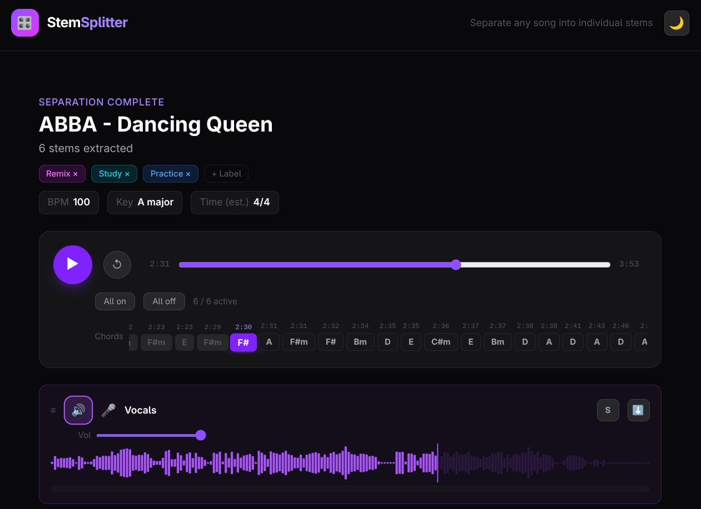

# StemSplitter

A local web app for splitting music into individual stems (vocals, drums, bass, guitar, piano, other) using AI-powered audio source separation.

Paste a YouTube URL, and StemSplitter will download the audio, separate it into stems using [Demucs](https://github.com/facebookresearch/demucs), and give you a mixer interface to solo, mute, and adjust each stem — with waveforms, peak meters, chord detection, and more.



> **Note:** There are currently no plans to make this app publicly available as a hosted service. It is primarily a project for me to practice AI-driven product development.

## Tech Stack

- **Frontend**: React + TypeScript + Vite + Tailwind CSS v4
- **Backend**: FastAPI (Python)
- **Audio Separation**: Demucs (`htdemucs_6s` — 6 stems)
- **Music Analysis**: librosa (BPM, key, time signature, chords)
- **YouTube Download**: yt-dlp
- **Real-time Progress**: WebSocket

## Features

- YouTube URL input with queue support
- Background processing — browse while stems are separating
- Interactive mixer with per-stem volume, solo, mute
- Waveform visualization with animated playhead
- Peak meters per stem
- Chord timeline synced to playback
- BPM, key, and time signature detection
- Track history with search, labels, and drag reorder
- Cancel in-progress jobs
- Fully local — no data leaves your machine

## Setup

### Prerequisites

- Python 3.12+
- Node.js 20+
- ffmpeg

### Backend

```bash
cd backend
python -m venv .venv
source .venv/bin/activate
pip install -r requirements.txt
uvicorn app.main:app --reload --port 8000
```

### Frontend

```bash
cd frontend
npm install
npm run dev
```

## License

[MIT](LICENSE)
